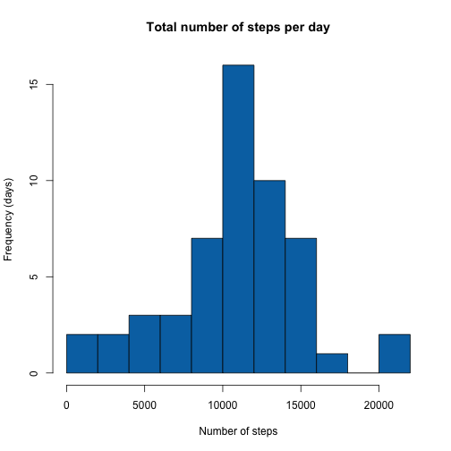
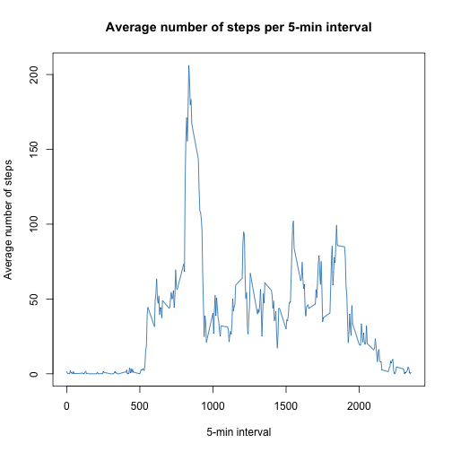
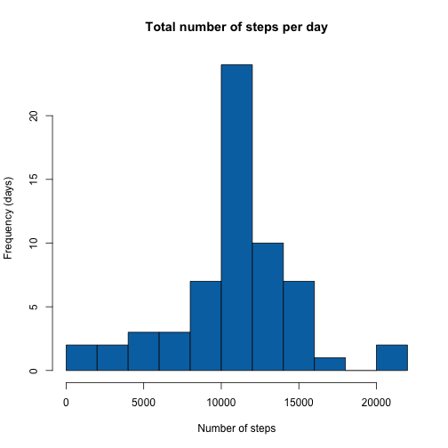
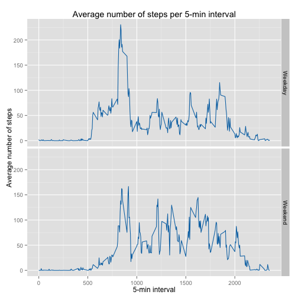

## Loading and preprocessing the data


```r
#load data
actData<-read.csv(file='activity.csv',sep = ',')

#convert to date format
actData$date <- as.Date(actData$date, "%Y-%m-%d")
```


## What is mean total number of steps taken per day?


```r
#Calculate and plot (histogram) the total number of steps per day
actDsum<-aggregate(steps~date,actData,sum,na.action = na.pass)

hist(actDsum[,2],breaks=10,xlab = 'Number of steps', ylab = 'Frequency (days)',
     main = 'Total number of steps per day',col = '#0072B2')
```

 


```r
#Calculate the mean and median of the total number of steps per day
actDmean<-mean(actDsum$steps,na.rm = TRUE)
actDmedian<-median(actDsum$steps,na.rm = TRUE)
```

Total number of steps taken per day mean: 1.0766189 &times; 10<sup>4</sup>  
Total number of steps taken per day median: 10765


## What is the average daily activity pattern?


```r
#Calculate and plot the mean of steps by 5 minute interval
actImean<-aggregate(steps~interval,actData,mean)

plot(actImean$interval,actImean$steps,
     type = 'l',
     col = '#0072B2',
     main = 'Average number of steps per 5-min interval',
     xlab = '5-min interval',
     ylab = 'Average number of steps')
```

 


```r
#Find the interval with the maximum mean value
maxRow<-which(actImean$steps==max(actImean$steps))
maxInt<-actImean[maxRow,1]
maxValue<-actImean[maxRow,2]
```

The interval with the maximum mean value is the 835th with value 206.1698113.


## Imputing missing values


```r
actDataNA<-sum(is.na(actData$steps))
```

Total number of missing values (NAs): 2304


Fill in all of the missing values in the dataset.

```r
#To keep the original data, copy into a new dataframe in order to replace NAs
actData2<-actData

#Find rows with NAs
NArows<-which(is.na(actData2$steps))

#To finalise the new "cleaned" dataset we do the following replace the steps' values in the NArows positions (all NAs) with the mean values of each step taken from the actImean dataframe from the previous section
actData2[NArows,'steps']<-actImean[,'steps'][match(actData2[NArows,'interval'],actImean[,'interval'])]

#This method ensures that the data remain consistent as the per interval mean values remain the same.

#Calculate and plot (histogram) the total number of steps per day
actDsum2<-aggregate(steps~date,actData2,sum)

hist(actDsum2[,2],breaks=10,xlab = 'Number of steps', ylab = 'Frequency (days)',
     main = 'Total number of steps per day',col = '#0072B2')
```

 


```r
actDmean2<-mean(actDsum2$steps)
actDmedian2<-median(actDsum2$steps)
```
The histogram trend is the same but with more data included as the NAs are replaced with actual values (mean). This can be observed by comparing the frequency axis values of the two plots.

The total number of steps taken per day mean (1.0766189 &times; 10<sup>4</sup>) is the same.  
The total number of steps taken per day median (1.0766189 &times; 10<sup>4</sup>) is not the same, but equal to the mean.


## Are there differences in activity patterns between weekdays and weekends?


```r
#Add a new variable to the current dataframe including the name of the day for the corresponding date.
actData2$weekday<-weekdays(actData2$date)

#Add an additional variable to the current dataframe including the name of the day for the corresponding date.
#However, the values of the weekfactor variable will be replaced with correct data.
actData2$weekfactor<-weekdays(actData2$date)
```


```r
#Create a dataframe with day names and corresponding types
daynames<-c('Monday','Tuesday','Wednesday',
            'Thursday','Friday','Saturday','Sunday')

daytypes<-c(rep('Weekday',5),rep('Weekend',2))
weekfactor<-cbind(daynames,daytypes)

weekfactor
```

```
##      daynames    daytypes 
## [1,] "Monday"    "Weekday"
## [2,] "Tuesday"   "Weekday"
## [3,] "Wednesday" "Weekday"
## [4,] "Thursday"  "Weekday"
## [5,] "Friday"    "Weekday"
## [6,] "Saturday"  "Weekend"
## [7,] "Sunday"    "Weekend"
```


```r
#Replace the day names in the weekfactor variable with the corresponding daytype values
#from the weekfactor dataframe.
actData2[,'weekfactor']<-weekfactor[,'daytypes'][match(actData2[,'weekfactor'],weekfactor[,'daynames'])]
```


```r
#Calculate and plot the mean of steps by 5 minute interval per week factor (Weekday,Weekend).
actImean2<-aggregate(steps~weekfactor+interval,actData2,mean)

library(ggplot2)

ggplot(actImean2,aes(interval,steps))+
       geom_line(color='#0072B2')+
       facet_grid(weekfactor~.)+
       labs(title='Average number of steps per 5-min interval',
            x='5-min interval',y='Average number of steps')
```

 


